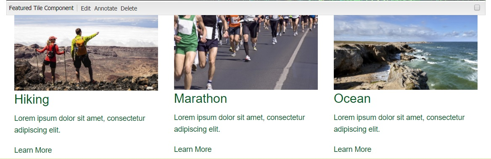

#  AEM project with Feature Tile Component

This project contains sample feature tile component which can be edited through Classic UI or Touch UI dialogs.

## How to build

This project requires the latest ACS Commons package.

Download from https://adobe-consulting-services.github.io/acs-aem-commons

To build all the modules run in the project root directory the following command with Maven 3:

    mvn clean install

If you have a running AEM instance you can build and package the whole project and deploy into AEM with  

    mvn clean install -PautoInstallPackage
    
Or to deploy it to a publish instance, run

    mvn clean install -PautoInstallPackagePublish
    
Or alternatively

    mvn clean install -PautoInstallPackage -Daem.port=4503

Or to deploy only the bundle to the author, run

    mvn clean install -PautoInstallBundle

## Page Location

Component is Already added to the following page

Navigate to /content/sampleaem/en.html to see an example